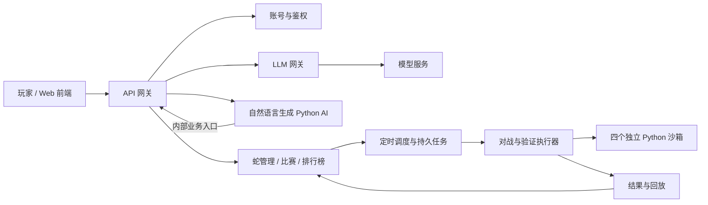

# Parseltongue

Parseltongue 是一个以 **自然语言编写贪吃蛇 AI、四蛇同场竞技、自动排位** 为核心的线上系统。

玩家用自然语言描述蛇的策略，系统调用模型生成 Python 脚本作为蛇的 AI。每局四条蛇在同一地图中自主竞争：撞墙、撞到蛇身或饥饿耗尽都会死亡，最终存活的蛇获胜。玩家可以试跑策略、观看回放，并将指定版本报名参加定时排位，由系统快速模拟比赛，按胜率生成排行榜。

> 当前已实现账号认证、业务与模型网关、四蛇试跑和回放，并已重做产品前端，包含竞技场、策略助手、对局记录和账号安全。“我的蛇”支持名字＋描述创建蛇，后台生成、试跑验证、自动修正后保存，并可在竞技场选择。生成检查和含自建蛇的整场比赛已接入 E2B，运行前需配置密钥；代码版本管理和排位仍待实现。见 [前端产品](demo-frontend/README.md)、[架构设计](docs/architecture.md)、[游戏服务](arena-service/README.md) 与 [规则引擎](match-worker/README.md)。

## 玩家使用流程

1. **注册并登录**：管理自己的蛇、策略与比赛记录。
2. **描述策略**：创建一条蛇，输入策略，例如“优先避免碰撞，饥饿较低时主动寻找食物，有机会时封堵对手”。
3. **生成 Python AI**：模型根据描述、游戏规则和统一脚本接口生成代码；系统检查并试跑，反馈结果或失败原因。
4. **试跑与迭代**：查看代码、比赛结果及回放，再通过自然语言调整策略。每次修改生成新版本，保留旧版本。
5. **报名排位**：选择一个通过校验的版本参赛。报名锁定代码版本，后续修改草稿不影响已经安排的比赛。
6. **查看排名与复盘**：系统定时匹配四条已报名的蛇，后台快速比赛；玩家查看胜率、有效对局数和回放，继续优化策略。

## 游戏规则

- **四蛇同台**：每条蛇由独立的 Python AI 决策，服务器收集同一回合的行动后统一结算。
- **碰撞死亡**：碰到墙壁、自己或其他蛇的身体会死亡。
- **饥饿机制**：饥饿值随游戏时间下降，归零死亡；吃食物恢复饥饿，促使蛇持续争夺资源。
- **最后存活者获胜**：胜负取决于生存，不以长度或食物数量代替最终胜负。
- **统一模拟时间**：饥饿按逻辑回合递减，与页面帧率、播放倍速和后台模拟速度无关。

同时全灭、头对头碰撞、食物刷新、饥饿数值等边界规则的首版建议见架构文档，其中尚未确认的参数均单独标注。饥饿能限制不进食的避战，但持续进食仍可能维持长局，因此另外设置技术运行上限；触发上限不按长度判胜。

## 目标能力

| 功能 | 系统行为 |
|---|---|
| 游戏与对战 | 四蛇同图，统一移动、进食、饥饿、碰撞与胜负结算；前端显示局面、存活状态和饥饿值 |
| Python 策略 | 读取标准局面，返回下一步方向；代码运行在独立受限环境，不能直接操作游戏或后台服务 |
| 自然语言生成代码 | 异步生成和修改策略，展示进度，进行语法、接口和沙箱试跑检查 |
| 蛇与版本管理 | 保存蛇档案、策略描述、代码和校验记录；参赛与回放关联不可变版本 |
| 试跑与回放 | 私有试跑不计入排行榜；保存比赛行动和状态，支持正常速度、加速播放及复盘 |
| 定时排位 | 周期性读取报名名单，匹配四条蛇，后台无画面快速模拟；不足四名玩家时等待 |
| 胜率排行榜 | 按赛季与参赛版本统计胜平负和胜率，展示有效场次、暂定成绩及更新时间 |
| 登录与权限 | 账号与会话管理；保护代码生成、蛇管理和报名操作，私有源码与提示词仅作者可见 |
| 统一业务网关 | 用户及服务间业务 API 均通过网关，公网与内部入口隔离，禁止直接访问后端业务端口 |
| LLM 网关 | 所有模型调用统一经过 LLM 网关，集中管理提供商密钥、模型路由、额度、超时和调用记录 |

模型仅在生成或修改策略时调用，比赛逐回合决策由 Python 脚本完成。在线展示与后台快速排位使用同一个规则引擎，播放速度不影响比赛结果。

## 架构概览



首版沿用 Java 后端，增加竞技业务服务、代码生成服务和独立执行器。蛇管理、比赛编排与排行榜先放在一个竞技服务内；用户 Python 代码的执行从一开始就与业务服务隔离。完整方案见 [架构设计](docs/architecture.md)。

图中调度和结果是竞技服务内的逻辑模块；实际 Worker 领取任务、上传回放与提交结果都经业务网关的内部入口。数据库连接和引擎与沙箱间的本地消息是专用数据通道，不向脚本开放。

## AI 执行与安全边界

当前支持内置 AI 和模型生成的蛇。每份候选检查、每场含生成代码的比赛都在独立 E2B VM 内完成，内部常驻子进程通过局面/方向协议通信。主机不执行生成代码，只对返回回放重算校验。VM 不获得业务凭据，不连接业务文件系统，并关闭外网；当前接受同局脚本互相干扰。配置见 [沙箱部署](match-worker/sandbox/README.md)。

- AI 每回合收到序列化的场面快照：地图、食物、各蛇位置/方向/饥饿值及自身局内 ID，不持有游戏引擎的真实对象。
- AI 只能返回一个方向；执行器根据可信任务绑定确定该动作属于哪条蛇，不接受脚本指定目标蛇、修改饥饿或提交胜负。
- 四条蛇分别运行在独立沙箱中，无网络、服务凭据、共享可写目录或对手代码，并限制 CPU、内存和输出。
- 模型输出始终视为不可信代码。生成后先保存候选版本，再做静态检查与隔离试跑，通过后才可报名；正式比赛仍在同等级沙箱内执行。
- 提示词约束和恶意代码检查用于降低风险，不能保证模型永远不生成恶意内容。安全依赖权限隔离、严格协议和运行时限制，即使检查漏过也不能授予额外能力。

## 当前实现状态

| 模块 | 状态 | 内容 |
|---|---|---|
| `gateway-service` | 已实现 | Spring Cloud Gateway，端口 `8080`；JWT 校验、API 转发、跨域、日志、错误处理 |
| `internal-gateway-service` | 已实现 | 内部服务网关，默认只监听 `127.0.0.1:8084`；服务令牌认证，仅转发两个模型接口 |
| `auth-service` | 已实现 | Spring Boot MVC、MyBatis，端口 `8081`；注册、登录、刷新、退出当前/全部设备、查询当前用户 |
| `demo-frontend` | 已重做产品界面 | Vinext、React；竞技场、策略助手、私有对局索引、账号安全、规则页；保留原目录名 |
| `arena-service` | 已实现原型 | 默认 `127.0.0.1:8082`，经网关核验会话、异步比赛、私有回放和任务限额 |
| `match-worker` | 已实现原型 | Python 四蛇引擎、四种固定 AI、JSON 回放和重算校验 |
| `llm-gateway-service` | 已实现基础 | Spring AI / OpenAI 兼容接口，端口 `8083`；双档模型注册、密钥集中管理、限额与超时，经 `internal-gateway-service`（`8084`）调用 |
| 数据存储 | 已实现基础 | MySQL、Flyway；用户与会话表、BCrypt 密码、JWT、刷新令牌轮换 |
| 自然语言创建蛇 | 已实现基础 | 名字＋描述、安全规则及恶意意图优先审查、玩法识别、代码生成与修正、36 项运行检查；内部过程不展示 |
| 蛇管理与代码版本 | 待实现 | 蛇档案、不可变版本、脚本校验与参赛闭环 |
| LLM 费用与审计 | 待完善 | 已有单次 token/并发限制、用量返回和日志；每日预算、持久化幂等与审计账本待实现 |
| 用户脚本沙箱 | 已接入 E2B | 每个检查/比赛一个 VM，内部常驻策略进程，返回回放在主机校验；需配置云端密钥 |
| 排位与排行榜 | 待实现 | 报名、调度、快速比赛、幂等结算、胜率榜 |
| 线上部署 | 待完善 | HTTPS、生产配置、独立执行节点、备份与监控 |

公网网关将 `/api/game/**` 转发到竞技服务，其他 `/api/**` 仍转发至认证服务，并拒绝 `/internal/**`。模型接口通过独立模块 `internal-gateway-service`（只监听 `127.0.0.1:8084`）访问，使用两段不同的服务令牌；完整 mTLS、Worker 内部路由和生产网络隔离尚未落地。已有角色检查框架，但没有用户管理后台。

模型服务预留 `low-cost`（简单测试/检查）和 `high-capability`（复杂生成/修复）两档，测试阶段均使用 `deepseek-v4-flash`。调用方按任务复杂度选择别名，以后可独立更换提供商及模型。启动方法、环境变量和请求示例见 [模型服务 README](llm-gateway-service/README.md)。

## 本地启动现有功能

需要 Java 17、Python 3.10+ 和 Node.js（前端声明要求 `>=22.13.0`）。自建蛇还需要 E2B SDK 与 API key，见 [配置说明](match-worker/sandbox/README.md)。

首次启动前，将 `.env.example` 复制为 `.env`，在本机填写数据库密码、JWT 密钥及所需的模型/E2B 凭据。配置文件没有可用的默认密码或默认 JWT 密钥；`.env` 和 `.local/` 已被 Git 忽略，只能保留在本机。

```powershell
Copy-Item .env.example .env
# 生成一个 JWT 密钥，将输出填入 .env 的 JWT_SECRET：
python -c "import base64,secrets; print(base64.b64encode(secrets.token_bytes(32)).decode())"
# 每次生成一个数据库密码或内部服务令牌，分别填入对应字段：
python -c "import secrets; print(secrets.token_hex(32))"
```

认证服务与公网网关必须使用相同的 `JWT_SECRET`；认证服务、竞技服务和 Docker MySQL 使用相同的 `DB_PASSWORD`。`MYSQL_ROOT_PASSWORD` 单独设置。模型生成还需要 `LLM_API_KEY`、两个不同的内部令牌 `LLM_GATEWAY_TOKEN` / `GENERATION_SERVICE_TOKEN`，以及运行生成代码所需的 `E2B_API_KEY`。使用普通单行值，不加引号或行尾注释。

Docker Compose 自动读取根目录 `.env`，直接运行的 Java 服务不会。每个 Java 服务终端先在仓库根目录执行以下命令，再运行对应 Maven 启动命令：

```powershell
Get-Content .env | ForEach-Object {
    if ($_ -match '^([A-Z][A-Z0-9_]*)=(.*)$' -and $Matches[2] -ne '') {
        [Environment]::SetEnvironmentVariable($Matches[1], $Matches[2], 'Process')
    }
}
```

也可使用模型/内部网关/竞技服务已支持的 `.local/*.properties` 文件，具体字段见各模块文档；这些文件不会随仓库上传。测试使用测试专用凭据和模拟服务，无需填写真实 API key。

启动 MySQL：

```powershell
docker compose up -d mysql
```

项目使用 Docker MySQL，通过 `127.0.0.1:3307` 连接（容器内部仍为 3306），避免与本机 MySQL 冲突。认证服务默认使用该地址；若启动配置中设置了 `DB_URL`，也应指向这个端口。数据库保存在命名数据卷中，更新容器端口不会删除数据。

已有 MySQL 数据卷不会因修改 `.env` 自动更新账户密码；已有实例需同步修改数据库内的账户密码，再更新服务配置。

分别在三个终端启动 Java 服务：

```powershell
.\mvnw.cmd -pl auth-service spring-boot:run
.\mvnw.cmd -pl gateway-service spring-boot:run
.\mvnw.cmd -pl arena-service spring-boot:run
```

在第四个终端启动前端；首次使用先安装依赖：

```powershell
cd demo-frontend
npm install
npm run dev
```

打开前端终端打印的地址（默认 `http://localhost:3000`）。首页即竞技场，登录后可以配置对局、查看回放、管理当前标签页的对局记录和账号会话。在“我的蛇”输入名字和描述，即可异步创建并试跑自己的蛇；创建功能还需启动模型服务及独立内部网关，详见 [启动说明](demo-frontend/README.md)。前端所有业务 API 经开发代理进入 `http://localhost:8080` 网关。本次仅本地运行，未上线。

不启动 Web 服务也能测试引擎：

```powershell
python match-worker/run_match.py --seed 42 --output match-worker/outputs/seed-42.json
python match-worker/run_match.py --verify match-worker/outputs/seed-42.json
```

内置 AI：`straight`（直行）、`cautious`（避碰）、`greedy`（贪食）、`forager`（寻路）。可用 `--ais` 按顺序指定四个名称。试跑不计排位；网页回放临时存内存，重启或容量回收后不可用。

## 验证

```powershell
.\mvnw.cmd test
cd demo-frontend
npm test
node node_modules/typescript/bin/tsc --noEmit --incremental false
cd ../match-worker
python -m unittest discover -s tests -v
```

后端测试覆盖认证、公网/内部网关、竞技服务、策略任务及模型服务；模型自动测试使用本地模拟提供商，不消耗真实模型额度。另有 28 项 Python 游戏测试，竞技测试包含实际启动 Python 完成比赛。前端 `npm test` 执行会话单元测试、类型检查及构建，不是浏览器端到端测试。游戏 HTTP 联调脚本为 `match-worker/smoke_gateway.py`，仅对测试数据库使用；模型真实联调脚本为 `llm-gateway-service/smoke_gateway.py`。
