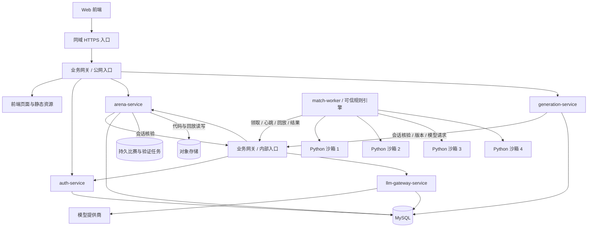
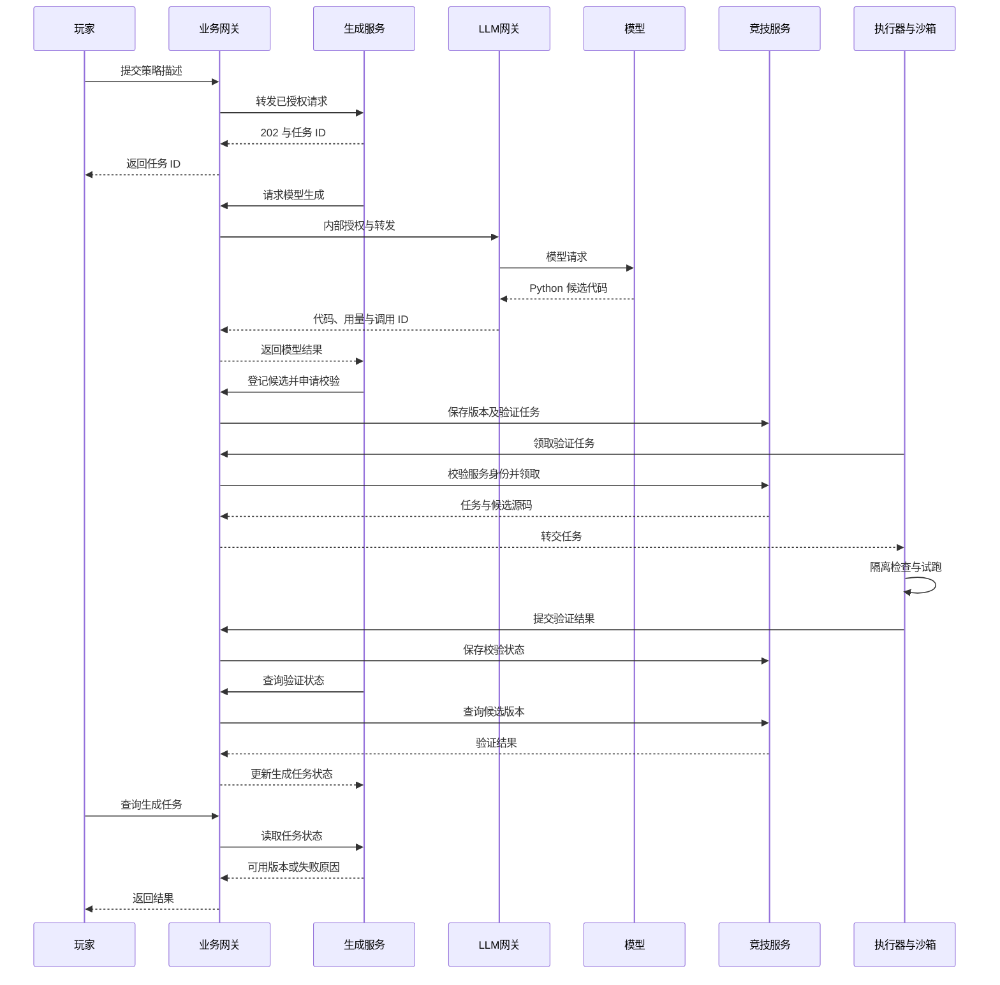

> 当前流程优先进行安全规则扫描及 `low-cost` 恶意意图审查，只有明确通过才进行玩法识别和 `high-capability` 代码生成，详情见 [竞技服务](../arena-service/README.md)。每份候选检查、每场含生成代码的完整比赛使用一个 E2B VM，36 项检查保持；四个常驻子进程在 VM 内执行策略，主机只负责调度、回收与回放重算。当前接受同局互相干扰，主要保护业务主机。云端运行需要配置 E2B 密钥，详见 [沙箱说明](../match-worker/sandbox/README.md)。下文尚未实现的版本化、排位、源码审核与审计部分是后续设计。

> 当前增量（自然语言创建蛇）：竞技服务已实现名字＋描述 → 后台生成 → Python 运行验证 → 最多两次自动修正 → 持久保存 → 私有试跑。用户接口为 `/api/game/snakes`；浏览器不接触模型、修复对话、源码或用量。内部入口使用独立 `internal-gateway-service`。当前执行器是本地子进程原型，生产安全沙箱仍为目标设计，详见 [竞技服务](../arena-service/README.md)。下文旧阶段说明以此增量为准。

# Parseltongue 架构设计

本文定义目标架构。当前已实现认证基础与四蛇游戏原型：`match-worker` 规则引擎/四种内置 AI、`arena-service` 异步试跑及前端 `/game` 回放。另已实现 `llm-gateway-service` 基础版和独立内部网关模块 `internal-gateway-service`（默认监听 `127.0.0.1:8084`）；下文的生产沙箱、持久任务、代码生成、排位、完整模型预算/审计以及 mTLS 仍为目标设计。

模型服务采用 Spring AI 2.0 与 OpenAI Chat Completions 兼容协议，预留 `low-cost`、`high-capability` 两档，由业务调用方按复杂度选择；测试时均映射到 `deepseek-v4-flash`，提供商和模型可独立注册。当前已实现 `/internal/llm/models`、`/internal/llm/generations`、两段服务令牌认证、单次 token/输入/并发限制与超时。持久化幂等、每日费用和用户额度尚未实现，详见 [模型服务](../llm-gateway-service/README.md)。以下更完整的控制要求不能视为当前已全部实现。

原型与目标的差异：当前只执行固定可信 AI，同一 Python 程序调用四个桩函数，不加载用户代码；Java 通过受限子进程调用 Python，这不等同于沙箱。试跑记录使用有界内存，尚未持久化。游戏 API 使用 `/api/game/**`，会话通过网关的现有 `/api/users/me` 核验；内部服务身份与专用 Worker 网络协议尚未接入。详见 [当前游戏服务](../arena-service/README.md)。

## 1. 产品规则与设计假设

当前前端已重做为产品工作空间：竞技场、策略助手、当前标签页对局记录、账号安全和规则页。策略助手通过竞技服务的受会话保护接口提交异步任务，再经内部网关访问模型服务；支持讨论、候选代码与检查改进，未实现代码执行、版本和参赛闭环。该适配暂放在竞技服务，未来再迁至独立 `generation-service`。本地配置通过 Git 忽略的 `.local/` 分服务保存，提供商 key 仍只由模型服务读取。

### 已确定的行为

玩家用自然语言描述策略，模型生成 Python AI。每局四条蛇同图竞技，撞墙、撞到蛇身或饥饿归零死亡，吃食物恢复饥饿，最后存活者获胜。已报名的蛇由定时任务自动匹配，后台快速模拟，以胜率排行。

模型不参与逐回合决策。比赛使用逻辑回合，饥饿随逻辑时间下降，不随计算机耗时、动画帧率或播放速度变化。

### 首版建议，尚可调整

| 项目 | 建议默认值 / 行为 |
|---|---|
| 地图 | `20 × 20`，四个对称出生点，初始长度 `3`，不穿墙 |
| 食物 | 场上维持 `5` 个，吃到后长度增加 `1`，在空闲格补充 |
| 饥饿 | 初值及上限 `100`，每回合减 `1`，每份食物恢复 `40`，最多恢复至上限 |
| 同时全灭 | 最后一轮因正常碰撞/饥饿同时死亡的剩余蛇记平局，之前淘汰者记败场；无胜者 |
| 头部碰撞 | 两个或更多蛇头进入同一格、两个蛇头交换位置，相关蛇均死亡 |
| 信息范围 | 所有 AI 获得完整棋盘和各蛇饥饿值；不获得对手源码或当回合未公开的动作 |
| 报名 | 玩家可保存多条蛇；每赛季同时一个有效报名；每局四个不同玩家 |
| 排位 | 每 `5` 分钟调度；至少 `20` 场有效对局才进入正式榜；未达标显示暂定成绩 |
| 超长比赛 | 技术回合上限暂定 `2000`；达到上限仍多蛇存活则标记 `NO_CONTEST`，不计胜率，不按长度判胜 |

饥饿可以阻止不进食的无限避战，但持续进食仍可能产生长局，因此技术上限用于控制成本。`NO_CONTEST` 次数公开展示，持续高比例触发时调整下一赛季规则；首版不擅自增加缩圈、加速饥饿或其他胜负条件。

地图、饥饿、食物、动作预算及统计口径形成不可变的 `ruleset_version` 与执行配置。同赛季不悄悄修改；影响公平性的变更开启新赛季。以上数字是原型起点，不是已完成的性能承诺。

## 2. 服务架构与职责



| 组件 | 职责 |
|---|---|
| Web 前端 | 策略描述、生成进度、代码查看、蛇和版本管理、报名、排行榜、局面与饥饿展示、回放；不裁决胜负 |
| `gateway-service`（已有基础） | 所有业务 API 的公网统一入口；内部入口已由独立模块 `internal-gateway-service` 承担，规划补充服务身份认证、路由授权、限流与大小限制 |
| `auth-service`（已有） | 账号、角色、登录会话、撤销；补充内部会话核验接口 |
| `arena-service`（新增，Java） | 蛇、版本、赛季、报名、调度、任务租约、结果接收、幂等结算、榜单、回放权限 |
| `generation-service`（新增，Java） | 异步生成、提示词模板、任务预算与修复流程；经业务网关调用 LLM 网关、登记版本和发起校验 |
| `llm-gateway-service`（新增） | 所有模型调用的唯一出口，持有提供商密钥，负责模型适配/路由、配额、调用超时、重试和审计 |
| `match-worker`（新增，Python） | 执行可信规则引擎，管理四个独立沙箱，记录每回合动作及状态；也负责版本验证任务 |
| MySQL | 持久业务状态和任务；首版共用实例、分服务账号，各服务拥有自己的表，不跨服务写表 |
| 对象存储 | 不可变脚本和压缩回放；数据库记录地址、内容哈希、所有者及保留状态 |

首版将蛇管理、比赛编排和排行榜作为竞技服务内的模块，便于任务创建与结算使用本地事务。生成和比赛都异步执行，HTTP 只提交任务并返回 ID。

先使用 MySQL 持久任务表，无需立即引入 Redis 或消息队列。Worker 经业务网关内部 API 领取任务，不直连数据库。后续吞吐量需要时，再采用事务 outbox 对接消息队列；排行榜缓存可由数据库重建。

### 2.1 所有业务请求经过网关

本设计将“所有请求”落实为：浏览器请求，以及服务之间、Worker 与服务之间的业务 API，均经业务网关（公网入口 `gateway-service` 与内部入口 `internal-gateway-service`）。数据库协议、业务服务到对象存储的数据连接、引擎与本机沙箱间的管道属于专用基础设施通道，不通过 HTTP 业务路由。模型提供商请求另由 LLM 网关作为唯一出口。

| 请求 | 强制路径 |
|---|---|
| 页面、静态资源、用户 API、回放下载 | 浏览器 → HTTPS 入口 → 公网业务网关 → 前端/业务服务 |
| 服务间 API | 调用服务 → 内部业务网关 → 目标服务 |
| Worker 领取、续约、读取代码、上传回放、提交结果 | Worker → 内部业务网关 → 竞技服务 |
| 模型调用（包括自动修复和未来其他模型功能） | 业务服务 → 内部业务网关 → LLM 网关 → 提供商 |

公网入口（`gateway-service`，8080）与内部入口（`internal-gateway-service`，8084）是独立的源代码模块，使用各自的监听、路由表和网络访问规则并分别部署。公网路由表完全不注册 `/internal/**`，不能仅靠路径前缀或 Host 头区分访问权限；后端业务端口只允许网关身份/网络来源连接，部署时不发布公网端口。业务服务不接受任意转发目的地址，网关也不能成为开放代理。

内部入口通过 mTLS 服务身份和逐路由权限区分调用者：生成服务只能申请模型调用及其负责的版本流程；Worker 只能访问执行任务 API，不能调用模型、登录管理或修改榜单。委托用户操作要携带可验证的用户上下文并检查归属，不能信任任意 `X-User-Id`。源码和回放首版由竞技服务流式读写对象存储，经网关传输，避免签名直传/下载绕过统一入口。

网关提供请求 ID、访问审计、连接/响应超时、请求体大小上限和用户/服务限流，使用多副本减少单点故障。大回放使用有大小上限的流式传输；异步任务不占用长期 HTTP 连接。故障时返回不可用，不允许客户端或服务直连绕过。

### 2.2 所有大模型请求经过 LLM 网关

LLM 网关只向内部业务网关暴露受保护接口，例如 `POST /internal/llm/generations`。生成服务提交经授权的用户/任务 ID、逻辑模型名称、消息、输出格式和预算；提供商地址与凭据由 LLM 网关配置，不能由玩家、脚本或模型输出指定。

- 提供商 API Key 仅存放在 LLM 网关部署密钥中，前端、生成服务、竞技服务和 Python 沙箱均不持有。
- 通过网络出口策略禁止其他服务直接访问模型提供商；只有 LLM 网关可连接配置中的提供商地址，故障时不直连降级。
- 模型白名单、每用户/任务并发、速率、输入大小、最大输出 token、超时、每日预算由网关强制执行；调用前预留额度，结束后按可得实际用量结算。
- 对调用状态不明的超时保留待核对额度，不当作免费失败立即释放。提供商层重试仅由 LLM 网关负责且每次计入预算，生成服务的修复属于新的候选任务，避免多层重试相乘。
- 以任务及 attempt 为幂等键避免内部重复派发；提供商若不支持幂等，无法承诺超时后绝对不重复计费，因此不盲目重放未知状态请求。
- 记录逻辑模型、实际提供商/模型、调用时间、token、费用和结果状态，返回 `llm_request_id`；敏感正文不进普通日志，确需保存的提示词采用作者权限和保留期。
- 首版只接收代码生成所需的文本/结构化输出，禁用模型工具执行。提示词描述游戏规则，但不能更改网关配额、出口、沙箱策略或文件路径。

LLM 网关负责模型访问治理，不证明代码安全；模型输出仍必须经过第 3.4 节的发布和执行流程。

### 新服务的鉴权

现有网关验证 JWT，认证服务还查询数据库验证会话。仅信任网关 JWT 校验会让新增服务漏掉已撤销会话。

竞技与生成服务通过统一鉴权组件，经内部业务网关调用认证服务核验接口，获取当前用户和角色。核验路由只校验调用服务身份和核验权限，不再次触发相同用户会话核验，以免递归。首版不缓存成功结果，使退出、禁用与角色变更在后续请求生效；认证服务故障时不降级放行受保护操作。

网关移除客户端伪造的身份头，业务服务检查蛇、版本、任务与报名的归属。公开榜单与公开排位回放可匿名读取，源码、提示词和私有试跑仅作者可见。Worker 使用独立服务身份与任务租约，无玩家令牌。用户退出不取消已提交任务；账号禁用后不接受新任务，并在开赛前取消尚未开始的比赛组。

## 3. AI 协议与可信规则引擎

### 3.1 Python 脚本接口

```python
def decide(observation: dict) -> str:
    """返回 UP、RIGHT、DOWN、LEFT 中的一个绝对方向。"""
    return observation["self"]["direction"]
```

| 输入字段 | 内容 |
|---|---|
| `protocol_version`、`ruleset_version` | 协议和规则版本 |
| `tick`、`max_ticks` | 当前回合与技术回合上限 |
| `board` | 宽、高、障碍物；原点左上，x 向右，y 向下 |
| `self` | 本方局内 ID、方向、从头到尾的身体坐标、存活状态、当前/最大饥饿值 |
| `snakes` | 四条蛇的同类公开状态，不暴露账号标识 |
| `food`、`hunger_rules` | 食物坐标、每回合消耗与食物恢复量 |

输入通过 JSON 序列化形成沙箱内的独立副本，不传入引擎对象、共享内存或可调用的游戏 API。脚本可以修改它自己的字典，但这些修改永远不会回写真实局面。所有蛇读取同一回合开始的快照，只在 `self` 上体现各自身份；不泄露未来食物、引擎随机源状态、对手尚未提交的方向或私有策略。

输入足以支持寻路、避碰、食物竞争和饥饿权衡：身体坐标明确头尾顺序，食物、地图边界、各蛇方向和饥饿全部可读；没有 `move_snake`、`set_hunger`、`kill`、写榜单等接口。

输出仅接受普通字符串枚举 `UP / RIGHT / DOWN / LEFT`。脚本返回的字典、目标蛇 ID、坐标、额外字段或多条消息全部拒绝。可信执行器维护如下绑定，不使用脚本自报身份：

```text
当前任务 + attempt + 当前回合 + 专属沙箱通信通道 → 固定 snake_id
该通道返回的合法方向 → 该 snake_id 的当回合动作
```

每个通道每回合只接受一个方向，超时或迟到消息丢弃，失步通道终止，不让旧消息被当作下一回合动作。可信执行器重新检查枚举、反向约束和存活状态，再交规则引擎统一裁决；沙箱不能指定其动作绑定给谁。各蛇的消息、日志和可写临时目录互不共享。

所有沙箱输出均视为不可信字节，在可信进程中按长度、深度、类型与消息数量上限解析 JSON，不能反序列化 `pickle` 或执行输出文本。调试输出走单独受限通道。具体帧格式在协议实现时固定，单次输入暂限 `64 KiB`、行动输出 `64 B`，单蛇单局调试日志 `64 KiB`，超限立即中止。

首版不提供跨回合记忆接口，脚本不应依赖全局变量。每回合使用新的用户解释器/隔离执行上下文；不能仅通过清空 `globals()` 假定环境已重置。可以预热不含用户代码的运行环境，但禁止复用执行过其他用户代码的环境；复用方案须通过隔离验证与压测。

服务端记录实际动作重放比赛，不承诺重新运行任意 Python 脚本一定生成相同动作。固定随机种子控制的是引擎的出生与食物生成。

### 3.2 每回合的顺序

1. 为所有存活蛇生成同一时刻的局面快照，隔离调用 AI，收齐动作或达到各自时间预算后统一推进。
2. 禁止反向移动。超时、抛错、非法方向或执行违规视为该蛇本回合故障淘汰，记录原因。
3. 根据有效动作计算拟移动蛇头、是否吃到食物及身体占用：未进食的蛇释放尾格，拟进食的蛇保留尾格；行动故障蛇的身体在本轮碰撞中仍占位。
4. 一次性判定越界、撞自己/他蛇身体、头对头和蛇头交换位置。不能因先处理某条蛇，让另一条蛇看到不同的结算状态。
5. 未碰撞的蛇完成移动及进食，计算 `新饥饿 = min(上限, 旧饥饿 - 每回合消耗 + 本回合食物恢复量)`；结果小于等于零则饿死。即饥饿剩 1 时，当回合吃到食物仍可存活。
6. 本轮死亡蛇在统一结算后移除，下一回合不保留尸体。只有成功存活的蛇消耗食物，随后用引擎随机源在空格补充；空间不足时尽量补齐。
7. 只剩一条活蛇则立刻获胜，其余记败场；全部死亡按下述规则处理；仍多条存活则继续，达到技术上限则无结果。

同时全灭的建议口径：最后一轮开始时仍存活且因正常碰撞/饥饿死亡的蛇记平局，其余败场；即使只有一个符合条件，也无胜者，因为胜利要求实际存活。脚本故障的蛇只记败场。若最后存活的蛇全部因脚本故障死亡，则该局无胜者、相关故障蛇均败，不把故意抛错记作平局。

规则引擎维护局面、饥饿和结果，策略通过观察与返回方向的接口参与。生成代码和整场引擎同在 E2B 内，当前不保证恶意策略无法干扰同局裁判；主机重算回放检验规则一致性。后台不等待动画，也不调用模型。

### 3.3 脚本隔离与资源预算

当前使用 E2B VM 作为执行边界。一次候选检查或整场比赛共用一个 VM，常驻策略子进程只承担普通故障控制，不承担对抗性隔离。没有逐回合远程调用，也没有每条蛇独立的云端启动开销。

- 每个 VM 只上传受信任的游戏运行文件和任务源码，不上传业务凭据，不挂载宿主目录；E2B API key 留在主机 SDK 控制进程。
- 创建时关闭互联网访问、限制公开入口、启用安全访问和到期销毁；模板由服务端配置。允许普通标准库，不再以 Python 语法白名单作为安全边界。
- 子进程加载 2 秒、每次决策 200ms CPU / 1 秒墙钟、地址空间 256MiB。进程限制不能阻止所有同局恶意干扰，VM 才是与业务主机之间的边界。
- E2B 命令最多等待 80 秒，VM 在 120 秒到期销毁，主机 Java 任务最多 130 秒；返回最多 8MiB。异常和超时都回收沙箱，失联由云端 TTL 兜底。
- 普通策略故障只淘汰对应蛇；创建、传输、整场预算、回放校验、回收故障归类为平台失败。不自动重试云任务或将基础设施故障反馈给模型修代码。
- 主机检查返回种子、规则、席位和回合数，再用记录的动作重算；不执行脚本。这验证规则一致性，不能证明动作未被同局程序操纵。

真实部署仍需验证所用 E2B 模板、账号配额与网络连通性；本地固定样例和模拟 SDK 测试不能替代云端验收。当前未实现反作弊、代码审核、不可变版本及持久调度队列。

### 3.4 防止模型输出变成系统权限

以下包含后续审核和版本管理设计。当前实现为 24KiB 源码上限、E2B 内实际加载/36 项检查、验证记录和逐场 E2B 执行；未实现以下 AST 白名单、签名凭据、撤销与人工代码展示。

需要同时处理两个风险：玩家通过提示词诱导模型生成恶意代码，以及恶意代码执行时越权。提示词过滤或另一个模型的审核不能保证前者不发生；因此所有生成代码和未来人工编辑代码都按不可信输入处理。采用输入分离、输出验证、最小权限与多层防护，依据 [OWASP 提示词注入防护指南](https://cheatsheetseries.owasp.org/cheatsheets/LLM_Prompt_Injection_Prevention_Cheat_Sheet.html)。

```text
策略描述 → LLM 网关 → 候选源码 → 静态检查 → 隔离试跑
                                            ↓ 通过
                          不可变可用版本 → 报名 → 正式沙箱执行
```

1. **输入与模型能力**：系统规则、用户描述、基础代码和试跑错误分栏传入；用户内容不能控制系统消息、提供商、工具、文件名或运行配置。提示词无密钥、后台令牌、其他用户代码。自动修复的日志同样视为不可信输入，脱敏、截断后作为数据提供。
2. **候选文件接收**：只接受有大小上限的 UTF-8 单个 Python 源文件，例如 `64 KiB`；服务端生成文件路径和版本 ID。模型输出没有保存路径、shell 命令、安装依赖或启动参数的决定权。源码与模型说明在网页上按文本转义展示，不执行 HTML 或自动加载任意远程资源。
3. **静态准入**：在受限校验进程解析 AST，限制源码大小、语法树规模和递归深度，核对 `decide` 签名，限制模块顶层为允许的定义/常量，采用库与语法能力白名单；拒绝动态加载、文件/网络/进程操作、动态执行及明显反射行为。禁止把“没有搜到危险关键词”当成通过依据；AST 也只是准入层，无法证明任意 Python 无害。
4. **校验隔离**：导入模块就可能执行顶层代码，因此导入、检查实际返回值、试跑和自动修复复测全部在与正式比赛同等级的沙箱中进行；不得在生成服务、竞技服务或可信引擎进程中 `exec`/导入用户脚本。代码通过只读文件传入，禁止拼接成 shell 命令。
5. **发布与执行一致**：校验通过绑定源码 SHA-256、协议、规则、镜像及安全策略版本。Worker 开赛前核对实际字节与这些记录，拒绝被替换或已撤销版本；源码变更必须新建版本重新验证。记录状态 `CANDIDATE → VALIDATING → READY / REJECTED`，后续可 `REVOKED`，只有兼容当前策略的 `READY` 可报名。
6. **正式运行限制**：即使通过校验仍逐场隔离，沙箱不获得任何服务凭据和网络，宿主强制资源/输出限制，只接受自身行动。有限测试不能覆盖隐藏分支或延迟触发，因此生产运行不能降低隔离等级。
7. **发现与处置**：越权尝试中止该脚本、记录受限审计事件，违规版本可撤销并阻止新任务；严重逃逸迹象停止整个执行节点派单并隔离调查。受影响比赛按平台事故处理，不直接结算可疑结果。

上线验证必须包含：提示词要求访问文件/联网，导入时执行恶意顶层代码、混淆与延迟触发、无限循环、内存与输出耗尽、伪造另一条蛇身份、跨沙箱通信、修改输入字典、重放旧回合消息、替换已校验文件以及恶意日志进入自动修复。验收目标是即便模型产出了恶意代码，也不能获得对手控制权或后台能力；静态检查漏过时运行限制仍有效。

## 4. 生成、试跑与回放



模型提供商由 LLM 网关适配，不预先绑定具体模型；密钥只在 LLM 网关中保存。生成服务经内部业务网关调用 LLM 网关，不能直连提供商。用户描述及代码作为输入数据，模型不获得管理后台、数据库或执行节点工具权限。生成任务记录模型标识、模板版本、基础版本、提示词、代码哈希、消耗、错误及 `llm_request_id`。

任务状态为 `QUEUED → GENERATING → VALIDATING → SUCCEEDED / FAILED / CANCELLED`；状态持久化，设置每用户并发、总时限、token/费用上限与幂等键。自动修复最多两次，每次候选保存为新版本重新验证，不能覆盖已参赛代码。

通过校验仅表示接口与试跑合格，不保证任意局面均正常运行。报名还需匹配当前赛季的规则、协议和运行环境。模型只处理用户自己的基础版本，不读取对手私有源码。

首版试跑用玩家指定版本加三条平台基准蛇，不计榜单。保存初始局面、种子、规则/引擎/镜像版本、固定参赛版本、每回合动作、饥饿变化、淘汰原因与最终结果。周期性状态快照支持回放拖动；只依赖已记录动作与引擎随机源复算，不重新调用 AI。

前端先采用任务轮询与完成后回放；后续直播可通过只读事件流发送状态，断线按序号续读，观众连接不能阻塞模拟。

## 5. 排位调度与排行榜

### 5.1 报名与匹配

1. 每赛季每位玩家一个有效报名，绑定不可变脚本版本。切换版本建立独立统计，已安排比赛继续使用原版本；撤回只影响后续批次。
2. 调度器按 `(season_id, scheduled_window)` 创建唯一批次，多实例仅一个创建成功。批次固化报名快照、配对种子和任务计划，故障恢复继续原计划。
3. 优先匹配有效场次少、轮空多的报名，减少近期重复对手；同优先级按记录的随机种子打散。每组必须来自四位不同玩家。
4. 每组安排四局，固定同一地图种子并轮换四个出生席位，使每条蛇各占每个席位一次。容量足够安排完整小组后才接纳。
5. 不足四名玩家等待；非四的倍数时记录轮空，下次优先安排。不用平台蛇填排位，也不允许玩家指定排位对手。
6. 同赛季上一批未结束时不无限叠加新批次，队列达到阈值时暂停派生新任务。试跑和排位分别设置配额与优先级。

席位轮换降低出生位置影响，不能完全消除策略相克、对手强度等偏差。按用户要求保留胜率排序，并公开有效场次与胜平负。

### 5.2 胜率口径

```text
有效对局数 = 胜场 + 平局 + 败场
胜率 = 胜场 / 有效对局数
```

- 唯一存活者记胜场；正常同时全灭按第 3 节记平局，不折算半胜；脚本故障记有效败场。
- 平台失败、取消与 `NO_CONTEST` 不进入分母；有效对局为零显示“暂无成绩”。榜单同时展示无结果场次。
- 四局小组全部正常完成后统一结算，避免只统计某些出生席位。单局平台失败先重试，最终失败或某局 `NO_CONTEST` 则整个小组不计胜率，并展示具体未结算原因。
- 达到最低场次进入正式榜，否则为暂定成绩；按未四舍五入的胜率降序，其次有效场次降序；仍相同则并列名次，用报名 ID 稳定展示顺序。
- 统计键为 `(season_id, snake_version_id)`。同版本撤回再报名保留成绩，新版本不继承旧胜率；旧版本归档可查，当前榜只展示有效报名。
- 赛季结束停止接纳报名与新批次，在约定收尾时限内完成已排任务，然后冻结榜单，不跨赛季结算。

### 5.3 租约、重试与幂等结算

执行任务状态：`QUEUED → RUNNING → SUCCEEDED / INVALID / CANCELLED`。平台故障在有限重试内回到 `QUEUED`；蛇的脚本错误是已完成比赛中的淘汰事件，不触发重新比赛。

竞技服务原子领取任务、设置租约并递增 `attempt_id`，Worker 定期续约。过期任务可重新派发，旧 attempt 的迟到结果必须拒绝。先上传回放并核验哈希，再提交结果；上传成功但事务失败的孤立对象延迟清理。

结果检查包含服务身份、租约、四个版本、规则、回合上限、结构与哈希。每场结果以 `match_id` 唯一，重复相同结果返回已有状态，冲突结果报警。四局小组结算在一个数据库事务中写唯一统计流水、更新胜平负并标记已结算；重复回调不会重复计分。按固定报名 ID 顺序加锁，死锁或事务失败重试整个事务。

榜单只读取已提交结算并返回更新时间。未来加入缓存后通过版本号刷新，缓存丢失可从数据库流水重建。

## 6. 数据模型

| 实体 | 所属服务 | 关键数据与约束 |
|---|---|---|
| `users`、`user_sessions` | 认证 | 现有账号、角色、禁用、会话过期与撤销信息 |
| `snakes` | 竞技 | 所有者、名称、策略简介、归档状态 |
| `snake_versions` | 竞技 | 蛇 ID、版本号、代码地址/哈希、协议、规则、镜像/安全策略版本、校验和撤销状态；蛇内版本唯一、代码不可变 |
| `generation_jobs` | 生成 | 用户、蛇、基础版本、提示词、状态、模型、预算、候选版本、幂等键 |
| `llm_calls`、`llm_quota_ledger` | LLM 网关 | 用户/服务/任务、调用幂等键、提供商与模型、状态、预留/实际消耗、待核对用量；不存明文密钥 |
| `validation_runs` | 竞技 | 脚本版本、规则与运行环境、验证任务、结果 |
| `seasons` | 竞技 | 时间、规则、饥饿与执行配置、最低场次、状态 |
| `season_entries` | 竞技 | 用户、赛季、版本、报名状态；锁定用户赛季记录保证单个有效报名，赛季版本唯一 |
| `match_batches`、`match_groups` | 竞技 | 调度窗口、报名快照、配对种子、四局小组与结算状态 |
| `execution_jobs` | 竞技 | 验证/试跑/排位类型、状态、租约、attempt、重试次数 |
| `matches`、`match_participants` | 竞技 | 小组、种子、固定版本、席位、开赛配置 |
| `match_results` | 竞技 | 每场唯一结果、回放地址/哈希、引擎版本、淘汰与无结果原因 |
| `ranking_ledger`、`ranking_stats` | 竞技 | 唯一结算流水及赛季版本胜平负，统计可重建 |

用户 ID 是跨服务引用，不跨服务建外键。仍被比赛或报名引用的策略采用归档，按保留期处理，不直接物理删除。公开回放不得包含提示词、源码、令牌或沙箱详细日志。

## 7. 接口与前端页面

下表为目标 API，只有第一行已存在；具体字段在实现时固化为 OpenAPI 契约。

| 接口 | 行为 | 权限 |
|---|---|---|
| `/api/auth/**`、`GET /api/users/me` | 现有认证与当前用户 | 按现有规则 |
| `/api/snakes`、`/api/snakes/{id}/versions` | 创建蛇、管理与查看版本 | 登录及资源归属 |
| `POST /api/generations`、`GET /api/generations/{id}` | 提交生成与查询进度 | 登录及任务归属 |
| `POST /api/matches/trials` | 不计分试跑 | 登录、版本归属、配额 |
| `GET /api/matches/{id}`、`GET /api/matches/{id}/replay` | 结果与回放 | 排位公开，试跑仅作者 |
| `POST /api/seasons/{id}/entries` | 报名或切换版本 | 登录及版本归属 |
| `DELETE /api/seasons/{id}/entries/me` | 撤回报名 | 登录及报名归属 |
| `GET /api/seasons/current`、`GET /api/leaderboards` | 赛季与分页榜单 | 公开、限流 |

页面规划：游戏首页、我的蛇、策略编辑与生成进度、试跑/回放、排行榜与报名、登录/注册。运营能力包括赛季管理、暂停调度、查看失败任务和账号状态；管理页面可后续补充。

接入新模块时按路径拆分网关路由，替换现有 `/api/**` 全部指向认证服务的配置。内部会话核验、LLM 调用、Worker 领取与结果提交仅注册到内部业务网关，不暴露到公网；所有服务间 API 均走该入口。

## 8. 线上部署与观测

- 浏览器统一走同域 HTTPS，生产入口反向代理 `/api`；Vite 开发代理不能作为线上 API 接入方案。
- 业务节点运行公网/内部业务网关、认证、竞技、生成和 LLM 网关，独立 Linux 节点运行 Worker 与沙箱；通过网络策略强制服务间业务 API 经内部网关，并禁止沙箱访问任何网络。
- LLM 网关是模型提供商唯一网络出口，只有它持有提供商凭据。其他服务无模型出口权限；对象存储仅对竞技服务开放，用户及 Worker 的文件传输均经业务网关。
- MySQL、对象存储限制访问来源，配置备份、恢复演练和保留期。JWT、数据库和模型密钥通过部署环境注入，不用仓库开发默认值。
- 线上刷新 Cookie 开启 `Secure`，优先维持同域和现有 `SameSite=Strict`；如需跨域，再单独设计 Cookie 和 CSRF 保护。
- 模型生成与比赛独立限制并发，按队列等待时长扩容；公开上线前测量单场 CPU/内存成本，验证隔离与故障恢复。
- 现有前端有 Sites/Cloudflare 脚手架配置，但未完成线上连接。前端托管方案不承担不可信 Python 执行，后者始终在独立节点。

重点指标：API 错误率、生成耗时与消耗、校验通过率、队列积压、租约过期、脚本超时率、平台失败率、饥饿死亡比例、超长无结果比例、榜单更新时间和结算冲突。请求 ID、生成任务 ID 与比赛 ID 用于关联日志，不记录令牌或完整私有提示词。

## 9. 实施顺序与验收

| 阶段 | 交付 | 验收 |
|---|---|---|
| 1：比赛原型 | 规则与协议、四条基准 AI、可信引擎、回放页 | 同步碰撞、尾格释放、增长、饥饿恢复/归零、同时全灭等规则测试通过；动作日志可重放 |
| 2：策略与隔离 | 蛇/版本存储、独立沙箱、资源预算与任务租约 | 死循环、内存/输出超限、文件与网络访问受限，不能跨沙箱或访问服务凭据 |
| 3：自然语言闭环 | LLM 网关、模型适配、异步生成、校验、错误反馈、版本迭代 | 全部模型请求经 LLM 网关；登录后能描述策略、获取代码并试跑；预算、失败与恢复行为可验证 |
| 4：自动排位 | 报名、赛季、调度、四局轮换、统计与榜单 | 四人报名后自动出结果；轮空、版本切换、平局、无结果和重复结算符合口径 |
| 5：线上运行 | 游戏前端、HTTPS、生产隔离、配额、监控、备份 | 注册→生成→试跑→报名→比赛→回放与榜单完整贯通；故障恢复及容量测试通过 |

额外验证多调度器并发、过期租约、迟到结果、回放上传失败、四局部分完成、撤回重报及榜单重建；新增服务必须验证会话撤销和资源归属。现有认证测试与前端构建不能替代上述验收。

网关验收需要从公网尝试访问内部路由、直连业务端口，以及从普通业务服务尝试直连模型提供商，均应失败；合法请求只通过相应网关成功。伪造服务/用户身份、无额度模型调用和网关故障后的直连降级也必须被阻止。

下一步优先确认饥饿数值、进食结算顺序、同时全灭、食物补充与超长比赛处理，再实现独立规则引擎。模型提供商与实际执行预算通过费用约束和原型压测确定。
